# Odonata

Odonata is an autonomous indoor drone controlled over a local network. I had the idea for the project, after I once bought a drone that broke after just two days because I struggled to control it manually. Sothat it doesn´t crash again, I decided to build a new,  autonomous drone and named it Odonata, after the Latin word for dragonfly.

The drone weighs about 300g and uses a 3S 11.1V 850mAh battery, giving it a flight time of roughly 5 minutes. With around 1100g of thrust, it achieves a 3:1 thrust-to-weight ratio, which allows precise flights. For navigation, it has 4 ToF (Time-of-Flight) sensors to track its position in the room, and it can perform controlled autonomous landings using a camera that detects AprilTags on the landing station. The landing station is designed with self-centering sticks, sothat even with a positioning error of about 1cm, the drone can still lands safely.

Odonata runs on a Raspberry Pi Zero 2W and a DarwinFPV flight controller, connected together via a custom PCB. With this setup the Pi can send and receive data using MAVLink commands (such as starting the motors, pitching, etc.). The project is split into two parts: the drone itself and a local server. The server hosts a web-based cockpit where you can monitor the drone, test the motors, and start-stop flights. Because it works locally, you can easily host the server on your laptop, PC, or a separate Raspberry Pi.

## Zine Poster

Here is the Zine poster of my project Odonata:

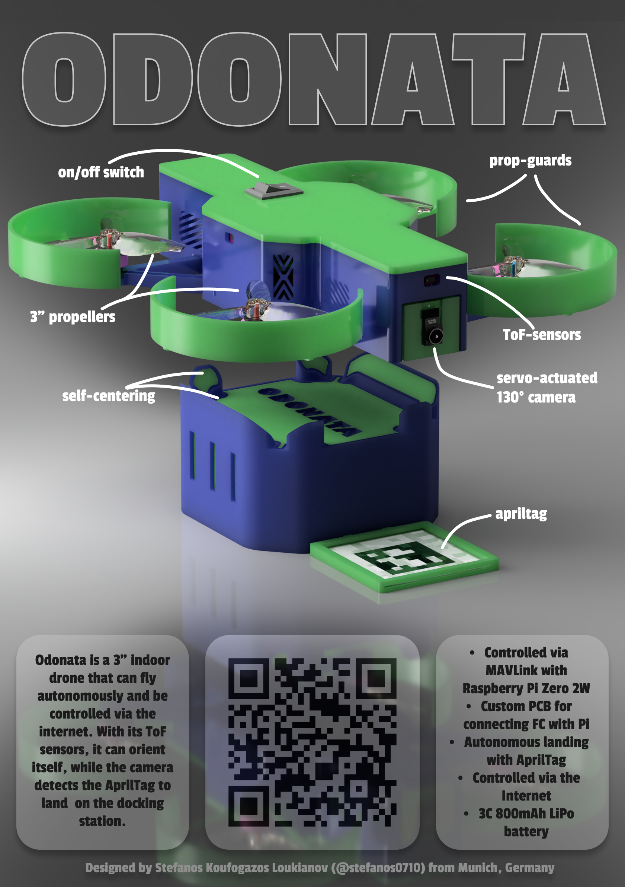

## Website/Cockpit

Here you can see the user interface of the cockpit where you can monitor the drone and send commands:
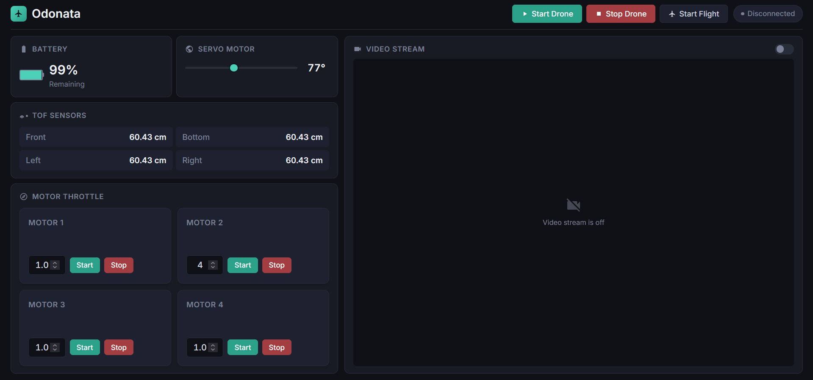

## CAD Model

The CAD design of Odonata is split into several parts, like the arms, the walls, the base, the cover, and the propguards. Everything is attached using M2 screws and heat inserts, or slide-ins and snap-fits. The .step, .stl and f3d/f3z files can be found at the /CAD directory. Here are some nice renders of the assembled drone:

(All parts were modeled and rendered in Autodesk Fusion 360)

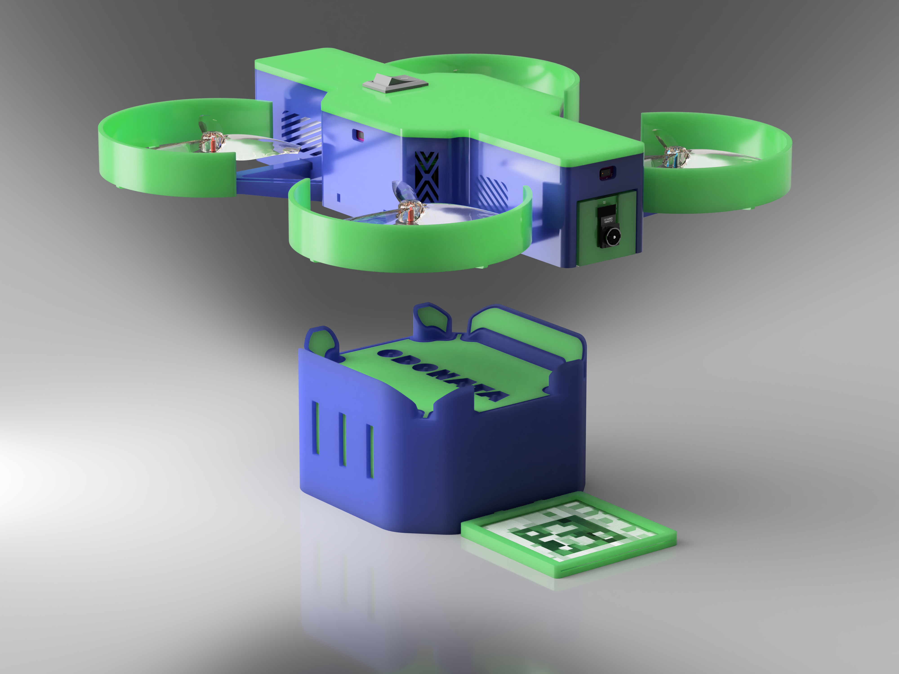

<details>
<summary><b>Click here to view more renders</b></summary>


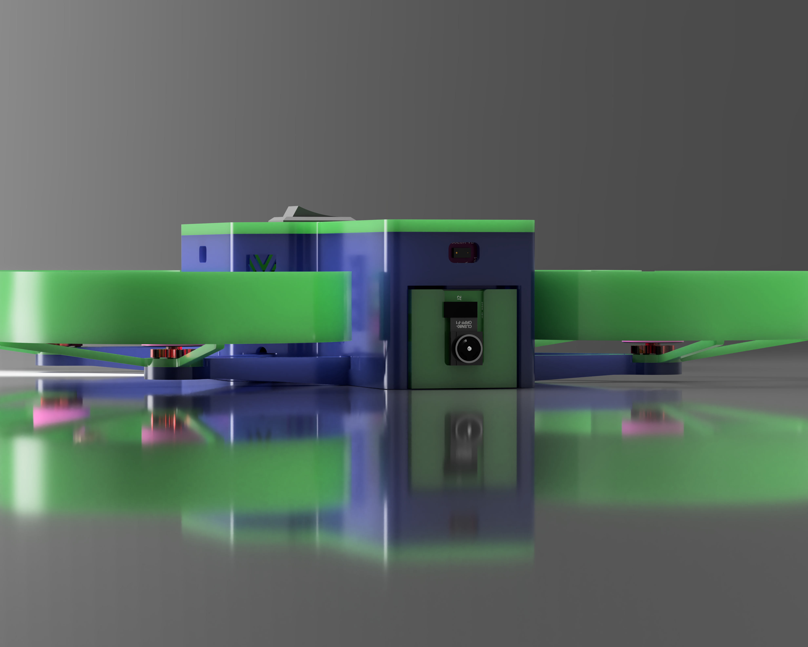


</details>

## PCB

This custom PCB is designed in KiCad and makes the flawless communication between the Flight Controller and the Raspberry Pi Zero 2W possible, and also connects the servo, the ToF sensors and camera to a working system. It uses a 4-layer design for the optimal routing and to ensure no noise on the power lines.

### Schematics

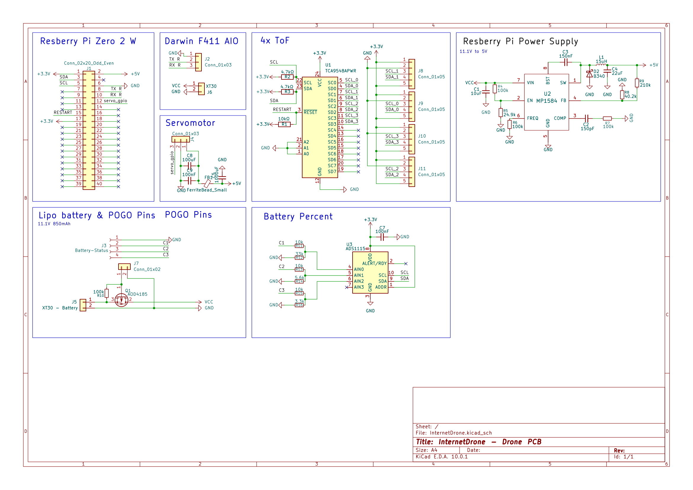

### PCB-Layers

The PCB uses 4 layers: 1. TOP-Signal layer 2. GND layer 3. Power layer 4. Signal and GND layer

#### **1. Layer (Top-Signal)**

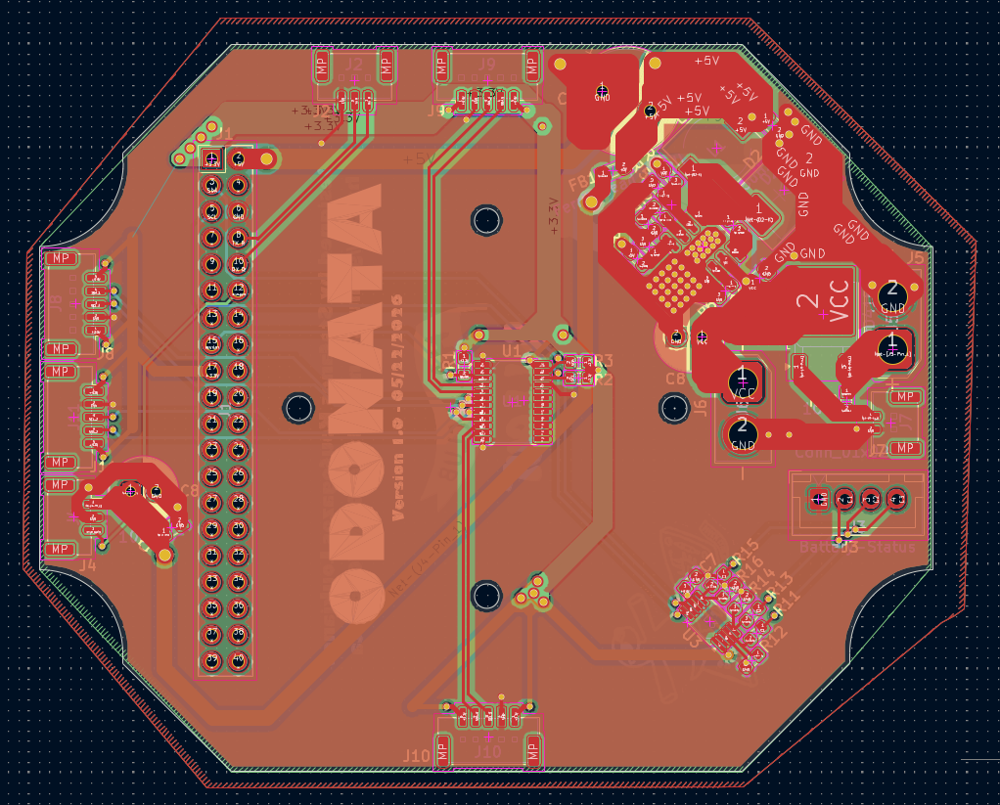

#### **2. Layer (GND)**

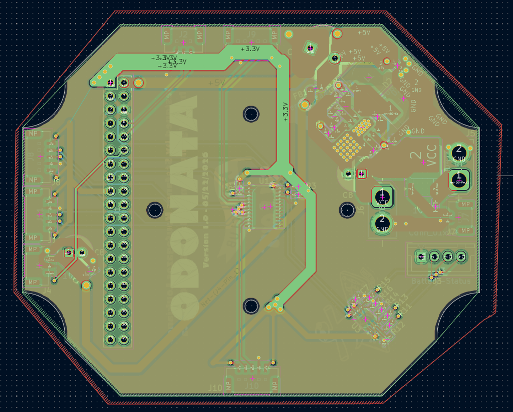

#### **3. Layer (Power)**

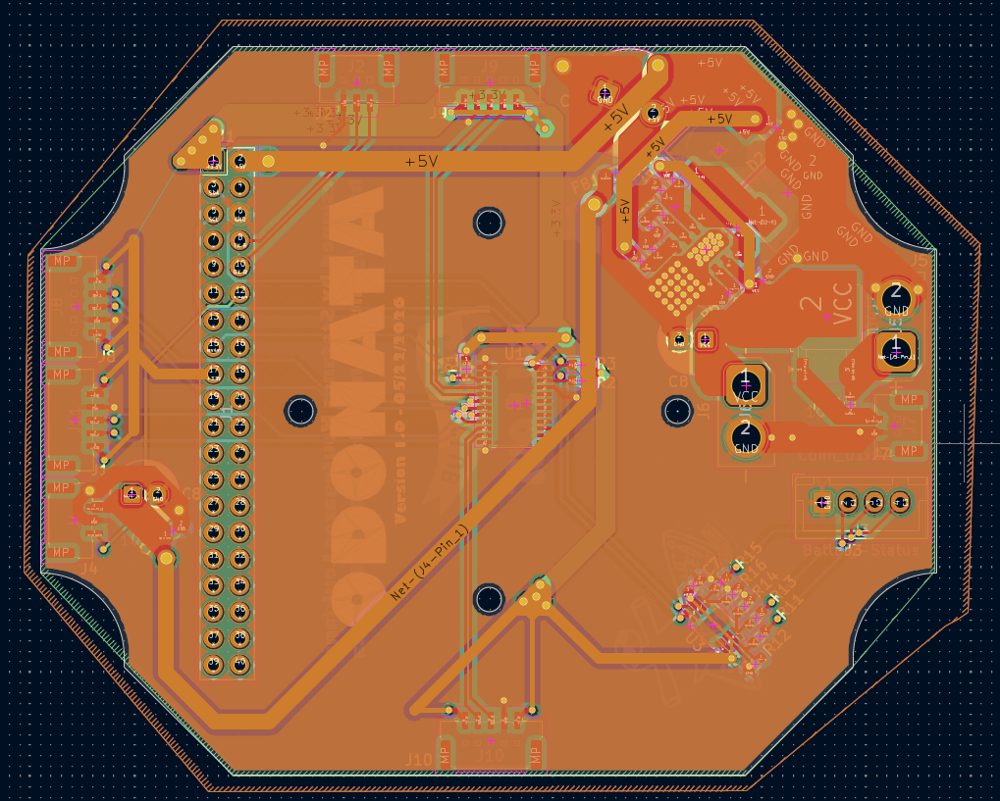

#### **4. Layer (Signal/GND)**

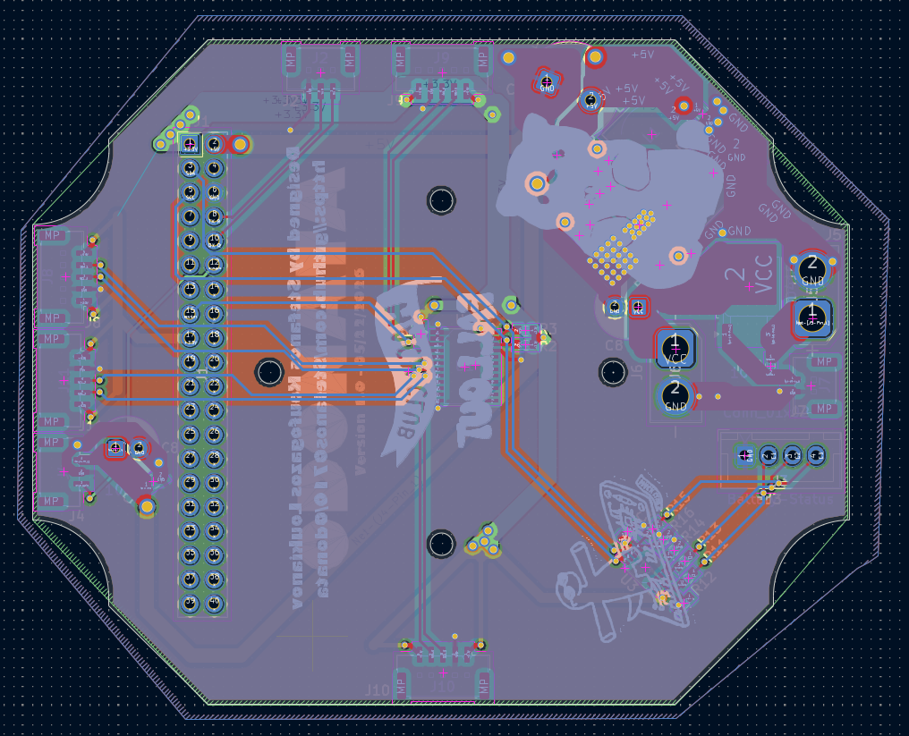

#### **PCB 3D-Rendering**

| Front | Back |
|----------|-------------|
| 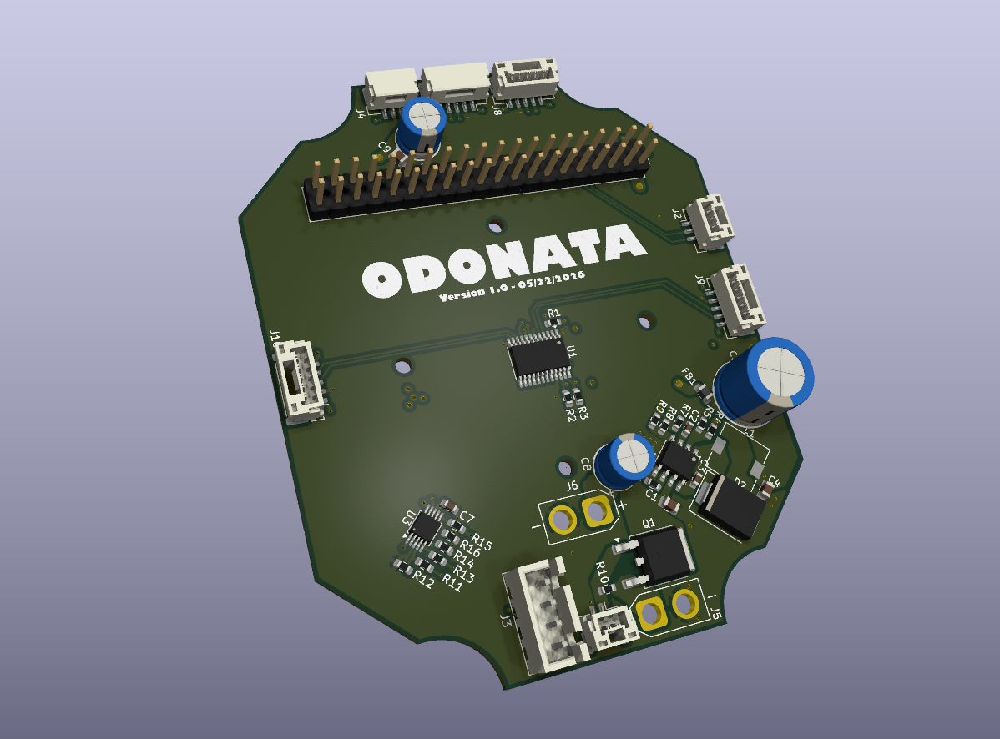 | 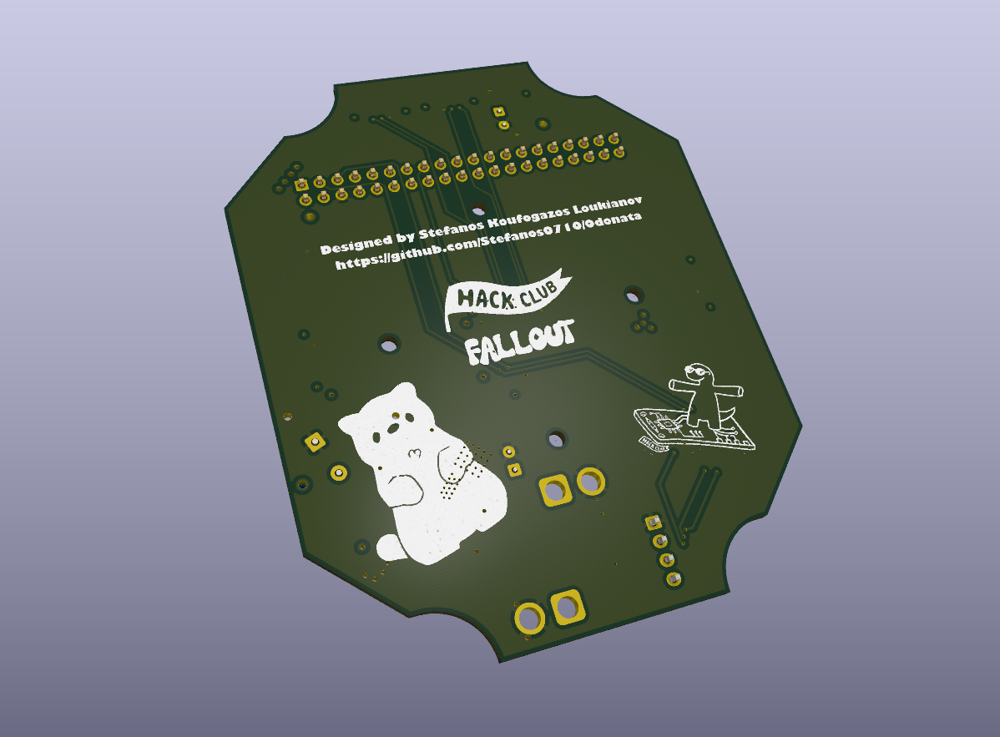 |

#### JLCPCB Order

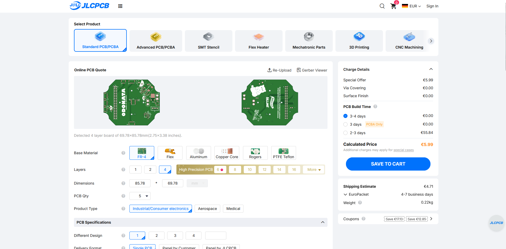

## How to build Odonata (Step-by-Step)

If you want to rebuild this drone without any modifications, you can follow these next steps. If you want to modify the drone, you can follow along the guide, you just have to adjust it to your changes:

### 1. Getting the parts

1. Download the whole repository on your computer by running these commands in your terminal to download the firmware, CAD, and PCB:

   ```bash
   git clone https://github.com/Stefanos0710/Odonata.git
   cd Odonata
   ```

   After that, you will have cloned the entire project onto your computer.

2. Next, you have to print out the 3D parts, and therefore you have 2 options, based on whether you have a 3D printer or not:
   1. If you have a 3D printer: upload the stl files from `/CAD/f3d_stl` into your slicer software. You have to print every file separately. So for the propguards you need 4, the motor arms you need 4, the base you need 1, the wall you need 1, the cover you need 1, and you need the camera holder. For the landing station, you need the catcher and the AprilTag holder.
   2. If you don't have a 3D printer, you can use a company like PCBWay, JLCPCB, or any other 3D printing service. There you have to upload the exact same files I mentioned previously and order them.
   3. Overall for the filament, if you can choose which one you can use, I would assume to use TPU for the propguards and print the rest with PETG for the best stability. For the color, if you like the style of the drone, it should be light/lime green and purple/blue.

3. Next, you should order the PCB. Therefore you need the gerber files which you find at `PCB/gerbers` as a `gerbers.zip` file. This file you can upload on a service like PCBWay, JLCPCB, or any other of your choice. Make sure to select 4 layers, and for the color it doesn't matter, but in this case I used the typical green one. Otherwise, I use the default options, so FR-4 as material.

4. Next, we need to get/buy the rest of the parts. A list with all parts you can find further down in the README, or in the `BOM.csv` file. There is the cost of the parts, the links, name, and description. INFO: the shipping cost is calculated for ordering to Bavaria, Germany, so it might change for you. But the rough price without shipping is 222,71€.

### 2. Setting up the Raspberry Pi Zero 2 W

After you got all the parts, we can start building the drone. And therefore we will start setting up the Raspberry Pi Zero 2 W:

1. Firstly, you need to download the Raspberry Pi Imager software on your computer, so that you can install the OS on the Raspberry Pi. First open this site https://www.raspberrypi.com/software/ and download it for your OS (Windows/macOS/Linux).
2. After downloading, you need to attach a micro SD card with at least 16GB to the computer, so that you can flash the OS and attach it later into the Raspberry Pi.
3. Then you choose the Raspberry Pi OS Lite, without the desktop, so that we don't waste resource power on that.
4. During that procedure, you will need to add the name (I assume to use "odonata" as the name), the WLAN (this must match the WLAN that you are connected to with your computer and later your server), and very important is to activate SSH, and lastly, you have to add a username and a password.
5. Then you detach the micro SD from your computer and attach it into the Raspberry Pi and connect it with a USB for power.
6. After waiting for about 5 min so that the OS can boot, you can type (for Windows):

   ```bash
   ssh yourusername@odonata.local
   ```

   And so you should be connected to the Raspberry Pi.
7. Now we update the system by typing in:

   ```bash
   sudo apt update
   sudo apt upgrade -y
   ```

8. After that, type in `sudo raspi-config` and activate the camera, the SPI, and the I2C.
9. After that, we have to install Python and Git. It's mostly already installed, but to update it's good:

   ```bash
   sudo apt install python3 python3-pip python3-venv git -y
   python3 --version
   pip3 --version
   git --version
   ```

   If you see no error, then everything is fine and installed.
10. And lastly, you have to copy the drone folder from firmware to the Raspberry Pi, and you can do it with this:

   ```bash
   git clone --depth 1 https://github.com/Stefanos0710/Odonata.git temp_repo
   mv temp_repo/firmware/drone ./drone
   mv temp_repo/firmware/requirements.txt ./
   rm -rf temp_repo

   cd drone
   pip install -r requirements.txt
   ```

11. Then, to activate the communication with the FC, you have to also add in `sudo raspi-config` under Interface Options -> Serial Port:
    - Login shell over serial? → No
    - Enable serial hardware? → Yes
    And then reboot.

### 3. Flight Controller Configuration

1. After we set up the Pi, we have to configure the FC (Flight Controller) so that we can use MAVLink on it. Therefore, you have to firstly install Mission Planner and then connect the FC with a USB cable to the PC.
2. Then you have to choose the COM port and the baud number that should be 115200, and then click Connect.
3. Then open the menu under Initial Setup and then Install Firmware, then select ArduCopter.
4. During that process, the firmware is installed and the FC is rebooted multiple times.
5. After that, you should read a text called ArduCopter Vx.x.x, and if Mission Planner connected again, then all is perfect.
6. Then we have to configure the parameters in Mission Planner. Therefore you go under Config to Full Parameter List and fill this out:
   - `SERIAL2_PROTOCOL = 2`
   - `SERIAL2_BAUD = 115`
7. This activates MAVLink2 which allows the communication with the Pi, and the baud number is the standard for drones with MAVLink. And after clicking on "Write Params", you are finished and you set everything up.

### 4. PCB Soldering

1. Now you have to solder all the SMD parts on the drone PCB. There isn't really a step-by-step for this, try to orientate yourself from the PCB renders, the schematics, and PCB layer 1.

### 5. Drone Assembly

After everything is soldered, you need to assemble the hardware parts:

1. Place the PCB on the base that was 3D printed, then add the placeholders (spacers) from the FC. Put the FC on it and screw it on with the M2 12mm screws.
2. Attach the Raspberry Pi to the male pins.
3. For the power, I firstly recommend to use a laboratory power supply so that you don't destroy your battery if something is wrong.
4. To connect everything, you need to connect the TX and RX cables from J2 with the RX and TX cables from the FC, and the rest of the parts are pretty easy to connect. Orientate yourself here again from the schematics and the PCB design.
5. Lastly run that command to install mavproxy:

   ```bash
   python3 mavproxy.py --master=/dev/serial0 --baudrate 115200 --aircraft MyCopter
   ```

6. And now we can attach the rest of the parts. Firstly, you have to insert the heat inserts with a soldering iron into the parts. Therefore you have to add them to the motor arms and the walls.
7. After that, you have to place the arms in the holding parts from the base and screw them with the M2 6mm screws into the base.
8. Next, you place the prop guards at the place where the motors go and screw them again with 6mm screws.
9. And now you have to lengthen the cables from the motors and place them in the cable canal from the arm into the inside of the drone, and solder the cables onto the FC pads for the motors.
10. Next, you have to attach the camera holder to the servo and also place the camera module into it, and place it in the front of the base. Make sure that the camera cable goes above the servo, connect the servo cable with its JST-GH cable, and attach it onto the PCB.
11. Next, solder the JST-GH cables to the ToF sensors and also add them to the PCB.
12. After all of this, you can place the walls and screw them on the base.
13. Next, place all the ToF sensors in their positions and make sure to press them in so that they hold their place. And now you are ready for the first test.

### 6. Server Setup

1. Go to your server computer or on the computer where you are currently working, and run these commands:

   ```bash
   git clone --depth 1 https://github.com/Stefanos0710/Odonata.git temp_repo
   mv temp_repo/firmware/server ./server
   mv temp_repo/firmware/requirements.txt ./
   rm -rf temp_repo

   cd server
   pip install -r requirements.txt

   fastapi dev
   ```

2. Then open `127.0.0.1:8000` and you will see the drone cockpit.
3. There you have to firstly add the IP by pressing "Connect Drone" or wait until the IP shows up, and connect the drone.
4. Then start the drone and test every motor and every component independently. If everything works fine, you are ready for the final step!

### 7. Final Touches

1. Now you can attach the propellers to the drone, and make sure they sit very tight.
2. After also attaching the battery and the on/off switch at the cover, you now have to print this paper out ([april_tag_print.pdf](images/april_tag_print.pdf)) and add it to the AprilTag holder.
3. Attach the AprilTag holder under the catcher, place the drone on the catcher, and let it start via the cockpit by pressing "Start Flight" and see the magic happen.

## BOM (Bill of Materials)

Here is a list of components and parts I used for this project:
(You can also find the csv file [here](BOM.csv))

| Name | Description | Link | Unit Cost (€) | Quantity | Price (€) | Shipping Cost | Total |
|---|---|---|---|---|---|---|---|
| C1 | 10uF 0805 Capacitor | [LCSC](https://www.lcsc.com/product-detail/C95841.html?s_z=n_q_t_Capacitors&spm=wm.fly.bg.6.xh___wm.ssy.tc.0.tz&lcsc_vid=Q1JYUFwDTgBYAVFWFVJbUwVfQ1BdVFFQRQBZXlEFE1MxVlNeR1FWVVFSQVNYUzsOAxUeFF5JWBYZEEoKFBINSQcJGk4NBhADEA4cHktXRlVaSQwSGg0%3D) | 0,03 | 10,00 | 0,34 | 18,91 | |
| C2, C3 | 150pF 0603 Capacitor | [LCSC](https://www.lcsc.com/product-detail/C37298.html?s_z=n_q_t_Capacitors&spm=wm.fly.bg.1.xh___wm.ssy.tc.0.tz&lcsc_vid=Q1JYUFwDTgBYAVFWFVJbUwVfQ1BdVFFQRQBZXlEFE1MxVlNeR1FWVVFSQVNYUzsOAxUeFF5JWBYZEEoKFBINSQcJGk4NBhADEA4cHktXRlVaSQwSGg0%3D) | 0,01 | 50,00 | 0,41 | 18,91 | |
| C4 | 22uF 0805 Capacitor | [LCSC](https://www.lcsc.com/product-detail/C602037.html?s_z=n_q_t_Capacitors&spm=wm.fly.bg.0.xh___wm.ssy.tc.0.tz&lcsc_vid=Q1JYUFwDTgBYAVFWFVJbUwVfQ1BdVFFQRQBZXlEFE1MxVlNeR1FWVVFSQVNYUzsOAxUeFF5JWBYZEEoKFBINSQcJGk4NBhADEA4cHktXRlVaSQwSGg0%3D) | 0,00 | 100,00 | 0,48 | 18,91 | |
| C5 | 1000uF Electrolytic Capacitors 10mm*5mm | [LCSC](https://www.lcsc.com/product-detail/C1579458.html?s_z=n_q_ESY108M010AH2EA%2520&spm=wm.fly.bg.0.xh&lcsc_vid=R1daUV0HFlVaAlIERwUNVlUATlNYBAdQQwNcVgFUQFgxVlNeR1FWUlRUR1RcUDsOAxUeFF5JWBYZEEoKFBINSQcJGk4dAgUUFAk%3D) | 0,15 | 1,00 | 0,15 | 18,91 | |
| C7 | 100nF 0603 Capacitor | [LCSC](https://www.lcsc.com/product-detail/C77058.html?s_z=s_c_Ceramic%2520Capacitors&spm=wm.fly.bg.26.xh&lcsc_vid=R1daUV0HFlVaAlIERwUNVlUATlNYBAdQQwNcVgFUQFgxVlNeR1FWUlZfQ1hfVzsOAxUeFF5JWBYZEEoKFBINSQcJGk4NBhADEA4cHktXRlVeSQwSGg0%3D) | 0,03 | 1,00 | 0,03 | 18,91 | |
| C8 | 100uF Electrolytic 6.3mm 11mm Capacitor | [LCSC](https://www.lcsc.com/product-detail/C135785.html?s_z=s_p_35PX100MEFC6.3X11&spm=wm.fly.bg.0.xh&lcsc_vid=R1daUV0HFlVaAlIERwUNVlUATlNYBAdQQwNcVgFUQFgxVlNeR1FWUl1TRVdaVjsOAxUeFF5JWBYZEEoKFBINSQcJGk4dAgUUFAk%3D) | 0,05 | 5,00 | 0,26 | 18,91 | |
| C9 | 100nF 0805 Capacitor | [LCSC](https://www.lcsc.com/product-detail/C1711.html?s_z=s_c_Ceramic%2520Capacitors&spm=wm.fly.bg.1.xh&lcsc_vid=R1daUV0HFlVaAlIERwUNVlUATlNYBAdQQwNcVgFUQFgxVlNeR1FWUVVQR1RZUjsOAxUeFF5JWBYZEEoKFBINSQcJGk4eFQsCAgIaSgADAwAHC0slRlJbUFxTWQkaCgg%3D) | 0,01 | 50,00 | 0,35 | 18,91 | |
| D2 | Schottky-Diode 3A | [LCSC](https://www.lcsc.com/product-detail/C7436556.html?s_z=n_q_B340%2520DO-214AB&spm=wm.fly.bg.1.xh&lcsc_vid=R1daUV0HFlVaAlIERwUNVlUATlNYBAdQQwNcVgFUQFgxVlNeR1FWUVBQQ1NXUDsOAxUeFF5JWBYZEEoKFBINSQcJGk4dAgUUFAk%3D) | 0,06 | 10,00 | 0,63 | 18,91 | |
| FB1 | Ferrite Bead 0805 300 ohm 2A | [LCSC](https://www.lcsc.com/product-detail/C67451.html?s_z=n_q_Ferrite%2520Bead%25200805%2520300%2520ohm%25202A&spm=wm.fly.bg.0.xh&lcsc_vid=R1daUV0HFlVaAlIERwUNVlUATlNYBAdQQwNcVgFUQFgxVlNeR1FWUVNVQlJWUDsOAxUeFF5JWBYZEEoKFBINSQcJGk4eFQsCAgIaSgADAwAHC0slQFVdUVFTQU8GEwkK) | 0,02 | 50,00 | 0,78 | 18,91 | |
| J1 | female connector with pi | [LCSC](https://www.lcsc.com/product-detail/C50980.html?s_z=n_q_p_Female%2520Header%25202.54mm%25202x20%2520vertical&spm=wm.ssy.bg.2.xh&lcsc_vid=R1daUV0HFlVaAlIERwUNVlUATlNYBAdQQwNcVgFUQFgxVlNeR1FWUV1QQ1ZcVzsOAxUeFF5JWBYZEEoKFBINSQcJGk4eFQsCAgIaSgADAwAHC0slQVZaUlVIHxUDCw%3D%3D) | 0,20 | 5,00 | 0,99 | 18,91 | |
| J2 | JST-GH 1x03-1MP_P1.25mm_Vertical | [LCSC](https://www.lcsc.com/product-detail/C161691.html?s_z=n_q_BM03B-GHS-TBT&spm=wm.fly.bg.0.xh&lcsc_vid=R1daUV0HFlVaAlIERwUNVlUATlNYBAdQQwNcVgFUQFgxVlNeR1FWUFdXRlNYUTsOAxUeFF5JWBYZEEoKFBINSQcJGk4eFQsCAgIaSgADAwAHC0slQlFXX1RIHxUDCw%3D%3D) | 0,67 | 1,00 | 0,67 | 18,91 | |
| J3 | JST-XH 1x04 | [LCSC](https://www.lcsc.com/product-detail/C144395.html?s_z=s_p_B4B-XH-A%28LF%29%28SN%29&spm=wm.fly.bg.2.xh&lcsc_vid=R1daUV0HFlVaAlIERwUNVlUATlNYBAdQQwNcVgFUQFgxVlNeR1FWUFBTQFlbXzsOAxUeFF5JWBYZEEoKFBINSQcJGk4dAgUUFAk%3D) | 0,05 | 10,00 | 0,48 | 18,91 | |
| J4 | JST-GH 1x03-1MP_P1.25mm_Horizontal | [LCSC](https://www.lcsc.com/product-detail/C514175.html?s_z=s_p_SM03B-GHS-TB%28LF%29%28SN%29&spm=wm.fly.bg.1.xh&lcsc_vid=R1daUV0HFlVaAlIERwUNVlUATlNYBAdQQwNcVgFUQFgxVlNeR1FWUFFRQFdXVTsOAxUeFF5JWBYZEEoKFBINSQcJGk4dAgUUFAk%3D) | 0,12 | 5,00 | 0,60 | 18,91 | |
| J5, J6 | XT30-Female Vertical | [LCSC](https://www.lcsc.com/product-detail/C19268023.html?s_z=n_q_Amass%2520XT30U%2520&spm=wm.fly.bg.3.xh&lcsc_vid=R1daUV0HFlVaAlIERwUNVlUATlNYBAdQQwNcVgFUQFgxVlNeR1FWUFxSQVNYXjsOAxUeFF5JWBYZEEoKFBINSQcJGk4dAgUUFAk%3D) | 0,21 | 5,00 | 1,06 | 18,91 | |
| J7 | JST-GH 1x02 vertical | [LCSC](https://www.lcsc.com/product-detail/C161690.html?s_z=n_q_BM02B-GHS-TBT&spm=wm.fly.bg.0.xh&lcsc_vid=R1daUV0HFlVaAlIERwUNVlUATlNYBAdQQwNcVgFUQFgxVlNeR1FWX1RQQlheUTsOAxUeFF5JWBYZEEoKFBINSQcJGk4eFQsCAgIaSgADAwAHC0slRlhcUVxWRVJADxALGw%3D%3D) | 0,18 | 5,00 | 0,91 | 18,91 | |
| J8, J9, J10 | JST-GH 1x05 Vertical | [LCSC](https://www.lcsc.com/product-detail/C189891.html?s_z=n_q_BM05B-GHS-TBT&spm=wm.fly.bg.0.xh&lcsc_vid=R1daUV0HFlVaAlIERwUNVlUATlNYBAdQQwNcVgFUQFgxVlNeR1FWX1VRRVRfUzsOAxUeFF5JWBYZEEoKFBINSQcJGk4eFQsCAgIaSgADAwAHC0slRldfUV1WWQkaCgg%3D) | 0,30 | 5,00 | 1,51 | 18,91 | |
| J11 | JST-GH 1x05 Horizontal | [LCSC](https://www.lcsc.com/product-detail/C189896.html?s_z=n_q_SM05B-GHS-TB) | 0,18 | 5,00 | 0,89 | 18,91 | |
| L1 | Inductor 7.3x7.3_4.5H 15uH 5A | [LCSC](https://www.lcsc.com/product-detail/C7461222.html?spm=wm.fly.bg.11.xh&lcsc_vid=QVFZAl1WRFhdX1wFRQNfXgFRTlRYVQdeRABaBl0CRFAxVlNeR1BcVFBQTlFcUTsOAxUeFF5JWBYZEEoKFBINSQcJGk4NBhADEA4cHktXRllfSQwSGg0%3D) | 0,88 | 1,00 | 0,88 | 18,91 | |
| Q1 | AOD4185 40V 40A | [LCSC](https://www.lcsc.com/product-detail/C5346822.html?s_z=n_q_AOD4185&spm=wm.fly.bg.1.xh&lcsc_vid=QVFZAl1WRFhdX1wFRQNfXgFRTlRYVQdeRABaBl0CRFAxVlNeR1BcU1ReR1JdVzsOAxUeFF5JWBYZEEoKFBINSQcJGk4eFQsCAgIaSgADAwAHC0slRVBYVl1QWQkaCgg%3D) | 0,16 | 5,00 | 0,81 | 18,91 | |
| R1, R11, R13, R15 | SMD Resistor 0603 10k 0.5% tolerance | [LCSC](https://www.lcsc.com/product-detail/C2930027.html?s_z=s_q_t_RESISTOR%252010K%25CE%25A9&spm=wm.fly.bg.1.xh___wm.ssy.tc.0.tz&lcsc_vid=QVFZAl1WRFhdX1wFRQNfXgFRTlRYVQdeRABaBl0CRFAxVlNeR1BcU1BfR1NYXjsOAxUeFF5JWBYZEEoKFBINSQcJGk4dAgUUFAk%3D) | 0,00 | 100,00 | 0,10 | 18,91 | |
| R2, R3 | 0603 4.7k 1% | [LCSC](https://www.lcsc.com/product-detail/C99782.html?s_z=n_q_t_0603%25204.7k%25201%2525&spm=wm.fly.bg.0.xh___wm.ssy.tc.0.tz&lcsc_vid=QVFZAl1WRFhdX1wFRQNfXgFRTlRYVQdeRABaBl0CRFAxVlNeR1BcUlRSQ1ZfUDsOAxUeFF5JWBYZEEoKFBINSQcJGk4eFQsCAgIaSgADAwAHC0slRVhdV1RUQE8GEwkK) | 0,00 | 100,00 | 0,14 | 18,91 | |
| R4, R6, R7, R10 | 0603 100k 1% | [LCSC](https://www.lcsc.com/product-detail/C2906980.html?s_z=n_q_t_0603%2520100k%25201%2525&spm=wm.fly.bg.1.xh___wm.ssy.tc.0.tz&lcsc_vid=QVFZAl1WRFhdX1wFRQNfXgFRTlRYVQdeRABaBl0CRFAxVlNeR1BcUlBXRFNYVzsOAxUeFF5JWBYZEEoKFBINSQcJGk4eFQsCAgIaSgADAwAHC0slTlhZX1ZIHxUDCw%3D%3D) | 0,00 | 100,00 | 0,11 | 18,91 | |
| R5 | 0603 24.9k 0,1 tolerance | [LCSC](https://www.lcsc.com/product-detail/C2654014.html?s_z=n_q_0603%252024.9k%25200.5%2525&spm=wm.fly.bg.1.xh&lcsc_vid=QVFZAl1WRFhdX1wFRQNfXgFRTlRYVQdeRABaBl0CRFAxVlNeR1BcUlJVRFReXjsOAxUeFF5JWBYZEEoKFBINSQcJGk4eFQsCAgIaSgADAwAHC0slRVheUV1eR08GEwkK) | 0,09 | 5,00 | 0,47 | 18,91 | |
| R8 | 0603 40.2k 1% | [LCSC](https://www.lcsc.com/product-detail/C12447.html?s_z=n_q_t_0603%252040.2k%25200%252C1%2525&spm=wm.fly.bg.1.xh___wm.ssy.tc.0.tz&lcsc_vid=QVFZAl1WRFhdX1wFRQNfXgFRTlRYVQdeRABaBl0CRFAxVlNeR1BcUlxWQVZeXjsOAxUeFF5JWBYZEEoKFBINSQcJGk4eFQsCAgIaSgADAwAHC0slRVdbU1RXQ08GEwkK) | 0,00 | 100,00 | 0,13 | 18,91 | |
| R9 | 0603 210k 1% | [LCSC](https://www.lcsc.com/product-detail/C54102584.html?s_z=n_q_t_210k%25200603&spm=wm.fly.bg.0.xh___wm.ssy.tc.0.tz&lcsc_vid=QVFZAl1WRFhdX1wFRQNfXgFRTlRYVQdeRABaBl0CRFAxVlNeR1BdUlVXT1FYXjsOAxUeFF5JWBYZEEoKFBINSQcJGk4dAgUUFAk%3D) | 0,0183 | 20 | 0,37 | 18,91 | |
| R12 | 0603 33k | [LCSC](https://www.lcsc.com/product-detail/C2075611.html?s_z=n_q_t_0603%252033k%25200.1%2525&spm=wm.fly.bg.1.xh___wm.ssy.tc.0.tz&lcsc_vid=QVFZAl1WRFhdX1wFRQNfXgFRTlRYVQdeRABaBl0CRFAxVlNeR1BcUl1TRFdZXjsOAxUeFF5JWBYZEEoKFBINSQcJGk4eFQsCAgIaSgADAwAHC0slRlNaU1NIHxUDCw%3D%3D) | 0,09 | 5,00 | 0,44 | 18,91 | |
| R14 | 0603 5.6k 0.1% | [LCSC](https://www.lcsc.com/product-detail/C445632.html?s_z=n_q_0603%25205.6k%25200.1%2525&spm=wm.fly.bg.1.xh&lcsc_vid=QVFZAl1WRFhdX1wFRQNfXgFRTlRYVQdeRABaBl0CRFAxVlNeR1BcUVVVQ1dfXjsOAxUeFF5JWBYZEEoKFBINSQcJGk4eFQsCAgIaSgADAwAHC0slRVFZUlJXRk8GEwkK) | 0,07 | 5,00 | 0,36 | 18,91 | |
| R16 | 0603 3.3k 1% | [LCSC](https://www.lcsc.com/product-detail/C2907023.html?s_z=n_q_t_3.3k%25200603&spm=wm.fly.bg.0.xh___wm.ssy.tc.0.tz&lcsc_vid=QVFZAl1WRFhdX1wFRQNfXgFRTlRYVQdeRABaBl0CRFAxVlNeR1BdU1xSQVFWVDsOAxUeFF5JWBYZEEoKFBINSQcJGk4eFQsCAgIaSgADAwAHC0slQ1dWUVxVWQkaCgg%3D) | 0,0011 | 100 | 0,11 | 18,91 | |
| U1 | TCA9548APWR | [LCSC](https://www.lcsc.com/product-detail/C130026.html?s_z=n_q_TCA9548APWR&spm=wm.fly.bg.0.xh&lcsc_vid=QVFZAl1WRFhdX1wFRQNfXgFRTlRYVQdeRABaBl0CRFAxVlNeR1BcUVBXR1leUTsOAxUeFF5JWBYZEEoKFBINSQcJGk4eFQsCAgIaSgADAwAHC0slQ1VbUVdUWQkaCgg%3D) | 0,57 | 1,00 | 0,57 | 18,91 | |
| U2 | mp1584en | [LiD/Aliexpress](https://de.aliexpress.com/item/1005007196431727.html?spm=a2g0o.productlist.main.8.5489RptfRptfDv&algo_pvid=5360c05b-13d8-4095-b5fc-a3890fa62c09&algo_exp_id=5360c05b-13d8-4095-b5fc-a3890fa62c09-7&pdp_ext_f=%7B%22order%22%3A%2288%22%2C%22eval%22%3A%221%22%2C%22fromPage%22%3A%22search%22%7D&pdp_npi=6%40dis%21EUR%214.58%210.99%21%21%2135.24%217.59%21%40211b655217801340919082663e8280%2112000039768133547%21sea%21DE%210%21ABX%211%210%21n_tag%3A-29910%3Bd%3A3d5500f9%3Bm03_new_user%3A-29895%3BpisId%3A5000000204872307&curPageLogUid=jxjSNTFxpzz5&utparam-url=scene%3Asearch%7Cquery_from%3A%7Cx_object_id%3A1005007196431727%7C_p_origin_prod%3A#nav-specification) | 4,58 | 1,00 | 4,58 | 0 | |
| U3 | ADS1115 | [LCSC](https://www.lcsc.com/product-detail/C468683.html?s_z=n_q_t_ADS1115&spm=wm.fly.bg.2.xh___wm.ssy.tc.0.tz&lcsc_vid=QVFZAl1WRFhdX1wFRQNfXgFRTlRYVQdeRABaBl0CRFAxVlNeR1BdU1FTTllfUjsOAxUeFF5JWBYZEEoKFBINSQcJGk4NBhADEA4cHktfRFNADxALGw%3D%3D) | 1,43 | 1,00 | 1,43 | 18,91 | |
| JST GH 1.25 Set | JST GH1.25 GH 1.25mm Connector Kit 2/3/4/5/6/7/8/9/10Pin Housing Pre-Crimped Cable Wire | [Aliexpress](https://de.aliexpress.com/item/1005009363803762.html) | 17,79 | 1,00 | 17,79 | 0 | |
| XT30-F cable | XT30U Amass 1PCS Male Female Connector Plug With 16 AWG | [Aliexpress](https://de.aliexpress.com/item/1005006871265256.html) | 4,73 | 1,00 | 4,73 | 0 | |
| Cable | 2 Pins Super Soft Black Red Silicone Cable | [Aliexpress](https://de.aliexpress.com/item/1005006762917521.html) | 1,08 | 1,00 | 1,08 | 0 | |
| Flight Controller | DarwinFPV F411 15A AIO (FC+ESC+RX) ELRS | [Rotorama](https://www.rotorama.de/product/darwinfpv-f411-15a-aio-fc-esc-rx-elrs) | 53,39 | 1,00 | 53,39 | 0 | |
| Motors | Happymodel EX1204 5000KV 3S 3" Motor | [Aliexpress](https://de.aliexpress.com/item/1005003283337242.html#nav-review) | 37,79 | 1,00 | 37,79 | 0 | |
| Props | Gemfan Hurricane 3016 3inch Toothpick 3X1.6X3 3-Blade PC Propeller | [Aliexpress](https://de.aliexpress.com/item/1005003324572840.html) | 7,89 | 1,00 | 7,89 | 0 | |
| Battery | Tattu 3S Lipo Battery 850 mAh 11.1 V 150C 3S1P | [Amazon](https://www.amazon.de/TATTU-850mAh-Battery-Stecker-Drohnen/dp/B0CXDKXJLP) | 23,99 | 1,00 | 23,99 | 0 | |
| Raspberry Pi Zero 2 W | Raspberry Pi Zero 2 W | [Pi-Shop](https://www.pi-shop.ch/raspberry-pi-zero-2-w) | 19,53 | 1,00 | 19,53 | 13,5 | |
| Camera | 130° 8MP Camera | [Aliexpress](https://de.aliexpress.com/item/1005007274396582.html#nav-review) | 8,11 | 1,00 | 8,11 | 0 | |
| ToF Sensor | VL53L0X Time-of-Flight (ToF) Laser Ranging Sensor Breakout 940nm | [Aliexpress](https://de.aliexpress.com/item/1005008557812009.html) | 3,24 | 4,00 | 12,96 | 0 | |
| PCB | 4 Layer custom PCB | [JLCPCB](https://cart.jlcpcb.com/quote?stencilLayer=4&stencilWidth=100&stencilLength=100&stencilCounts=5&plateType=1&spm=Jlcpcb.Homepage.1010) | 5,99 | 1,00 | 5,99 | 7,81 | |
| Raspberry Pi Pin Header | BOOMELE(Boom Precision Elec) 2.54-2*20P | [LCSC](https://www.lcsc.com/product-detail/Female-Headers_BOOMELE-Boom-Precision-Elec-C50982_C50982.html) | 0,26 | 5,00 | 1,29 | 18,91 | |
| Screw 6mm | 50pcs Black 304 Stainless Steel Cross Phillips CM M2 6mm | [Aliexpress](https://de.aliexpress.com/item/1005005618746295.html) | 2,00 | 1,00 | 2,00 | 0 | |
| Screw 12mm | 50pcs Black 304 Stainless Steel Cross Phillips CM M2 12mm | [Aliexpress](https://de.aliexpress.com/item/1005005618746295.html) | 2,52 | 1,00 | 2,52 | 0 | |
| Heat insert | 50pcs M2 2mm | [Aliexpress](https://de.aliexpress.com/item/1005008318533389.html) | 2,66 | 1,00 | 2,66 | 0 | |
| Switch | KCD1 15*21mm 2 Pin Boat Switch | [Aliexpress](https://de.aliexpress.com/item/1005007987928702.html) | 0,38 | 5,00 | 1,90 | 18,91 | |
| Servo | SG90 | [Aliexpress](https://de.aliexpress.com/item/1005008107550639.html) | 1,91 | 1,00 | 1,91 | 0 | |
| **Sum Costs** |  |  |  |  | **224,62** | **40,22** | **264,84** |

Huge thanks to Fallout from Hack Club for inspiring me to build this project and for financing it!
